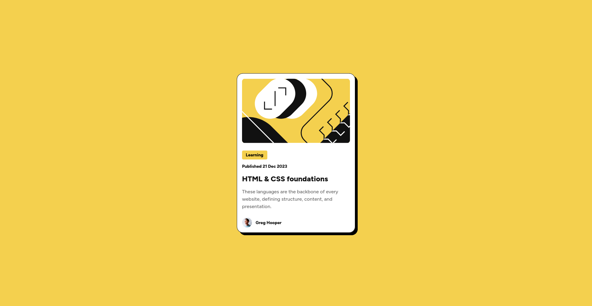

<!-- omit in toc -->
# Frontend Mentor - Blog preview card solution

This is a solution to the [Blog preview card challenge on Frontend Mentor](https://www.frontendmentor.io/challenges/blog-preview-card-ckPaj01IcS).

<!-- omit in toc -->
## Table of contents

- [Overview](#overview)
  - [The challenge](#the-challenge)
  - [Screenshot](#screenshot)
  - [Links](#links)
- [My process](#my-process)
  - [Built with](#built-with)
  - [What I learned](#what-i-learned)

## Overview

### The challenge

Your challenge is to build out this blog preview card and get it looking as close to the design as possible.

Your users should be able to:

- See hover and focus states for all interactive elements on the page

### Screenshot

Here’s a preview of my solution:

### Links

- [Solution URL](https://www.frontendmentor.io/solutions/flexbox-solution-rd_-hv3WWd)
  
- [Live Site URL](https://ronogue.github.io/frontend-mentor-challenges/blog-preview-card/)

## My process

### Built with

- Semantic HTML5 markup
- Flexbox
- Mobile-first workflow

### What I learned

This time, I improved my knowledge of media queries and the `drop-shadow` CSS function.