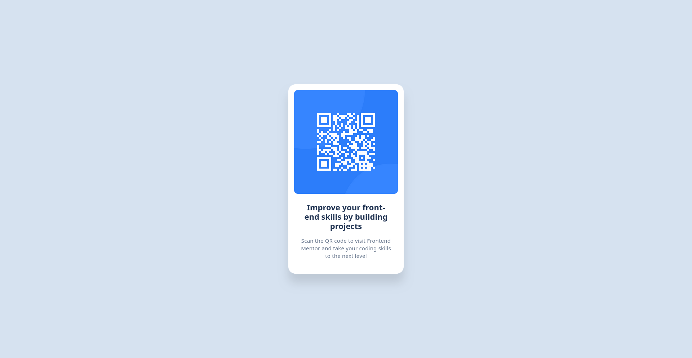

<!-- omit in toc -->
# Frontend Mentor - Social Links Profile Solution

This is my solution for the [Social Links Profile challenge on Frontend Mentor](https://www.frontendmentor.io/challenges/social-links-profile-UG32l9m6dQ).

<!-- omit in toc -->
## Table of Contents

- [Overview](#overview)
  - [The Challenge](#the-challenge)
  - [Solution Screenshot](#solution-screenshot)
  - [Links](#links)
- [My Process](#my-process)
  - [Built With](#built-with)
  - [What I Learned](#what-i-learned)

## Overview

### The Challenge

The challenge was to create a QR code component and match the design as closely as possible.

### Solution Screenshot

Here’s a preview of my solution:

### Links

- [Live Site URL](https://ronogue.github.io/frontend-mentor-challenges/qr-code-component/)

## My Process

### Built With

I began by analyzing the Figma design, then structured the HTML before refining the layout with Flexbox. To challenge myself and improve my CSS skills, I chose to use only pure CSS without any libraries like Tailwind CSS. My focus was on:

- Semantic HTML5 markup  
- Flexbox for layout styling  

### What I Learned

Through this project, I strengthened my understanding of CSS Flexbox and revisited the box-shadow property.
