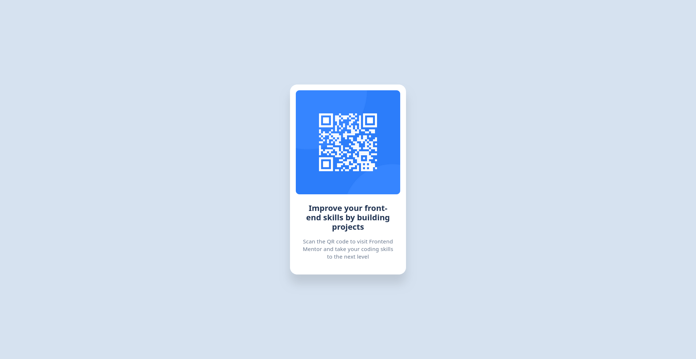

<!-- omit in toc -->
# Frontend Mentor - Solução do Desafio: Perfil de Links Sociais

<!-- omit in toc -->
## Tabela de Conteúdos

- [Visão Geral](#visão-geral)
  - [O Desafio](#o-desafio)
  - [Captura de Tela da Solução](#captura-de-tela-da-solução)
- [Meu Processo](#meu-processo)
  - [Construído com](#construído-com)
  - [O que Aprendi](#o-que-aprendi)

## Visão Geral

### O Desafio

O desafio foi criar um component de QR Code e deixá-lo o mais próximo possível do design.

### Captura de Tela da Solução

Aqui está uma prévia da minha solução:

## Meu Processo

### Construído com

Comecei analisando o design no Figma, depois estruturei o HTML antes de refinar o layout com Flexbox. Para me desafiar e aprimorar minhas habilidades em CSS, escolhi usar apenas CSS puro, sem bibliotecas como o Tailwind CSS. Meu foco foi em:

- Marcação HTML5 semântica  
- Flexbox para estilização do layout  

### O que Aprendi

Com este projeto, aprimorei minha compreensão do CSS Flexbox e revisei a propriedade box-shadow.
